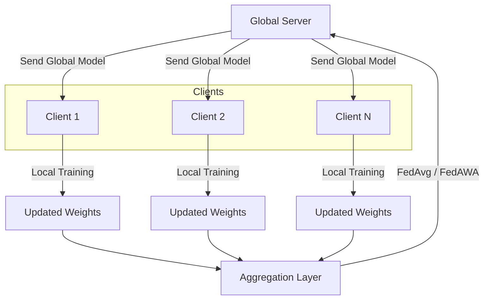

# 🧠 Distributed Learning for Retail Shelf Void Detection  
### Federated Learning using FedAvg & FedAWA

## 📌 Overview
This project implements a **Distributed (Federated) Learning framework** for detecting **voids (empty spaces) in retail shelves** using computer vision.  

Instead of centralizing data, the model is trained across multiple clients using:
- **Federated Averaging (FedAvg)**
- **Federated Adaptive Weight Aggregation (FedAWA)**  

This approach ensures:
- Data privacy  
- Scalability across stores  
- Reduced data transfer  

---

## 🎯 Problem Statement
Retail stores often face revenue loss due to **empty shelf spaces (voids)**. Detecting these in real-time can:
- Improve inventory management  
- Increase product availability  
- Boost sales  

---

## 📊 Dataset
- **Retail Shelf Void Detection Dataset**
- Source: Kaggle  
- Contains labeled images of:
  - Shelf with products  
  - Shelf with voids (empty spaces)

---

## 🏗️ Project Architecture

---

## ⚙️ Methodology

### 🔹 Federated Averaging (FedAvg)
- Clients train locally on their data  
- Model weights are averaged at the server  
- Simple and widely used baseline  

### 🔹 Federated Adaptive Weight Aggregation (FedAWA)
- Improves over FedAvg by:
  - Assigning adaptive weights to clients  
  - Handling non-IID data better  
  - Improving convergence  

---

## 🧪 Model Pipeline

1. Data Preprocessing  
2. Client-wise Data Partitioning  
3. Local Model Training (CNN)  
4. Global Aggregation (FedAvg / FedAWA)  
5. Evaluation on Validation/Test Set  

---

## 📈 Results

| Model  | Accuracy | Loss | Notes |
|--------|---------|------|------|
| FedAvg | 90.88%     | 23%   | Baseline |
| FedAWA | XX%     | XX   | Better convergence |

---

## 🛠️ Tech Stack

- Python  
- TensorFlow / PyTorch  
- NumPy, Pandas  
- Matplotlib  
- Federated Learning (custom implementation)

---

### 👩‍💻 Author

<b>Shatakshi Mondal</b> 
  
Aspiring ML Engineer | NLP & CV Enthusiast

